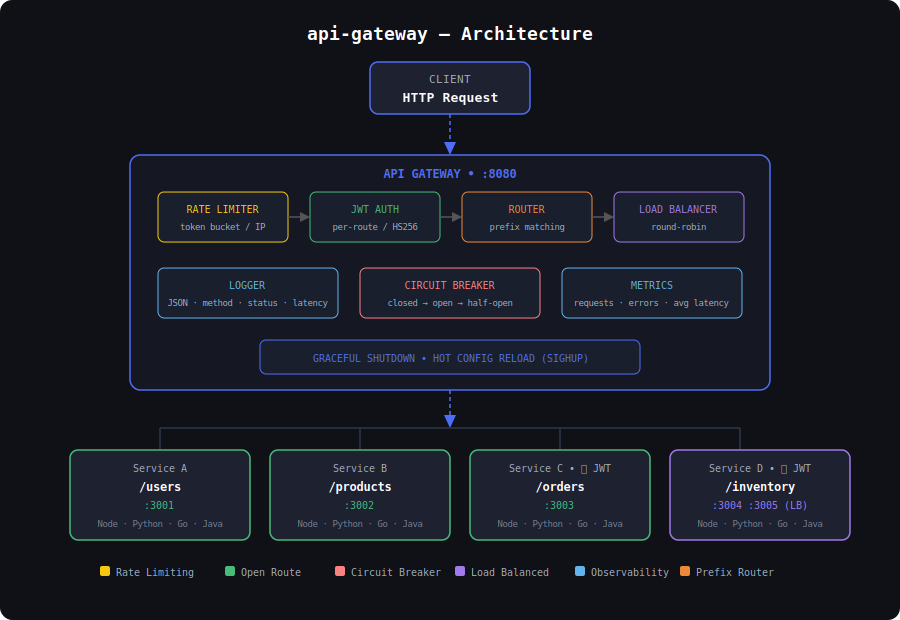

<div align="center">

# api-gateway

A lightweight, production-ready API Gateway written in Go.

**Request routing · Rate limiting · JWT authentication · Load balancing · Circuit breaking**

</div>

---

## What is this?

`api-gateway` is a standalone binary that sits in front of your backend services. You configure it with a single YAML file and run it. That's it.

Your services can be written in **any language** — Node.js, Python, Go, Java, whatever. The gateway doesn't care. It just forwards HTTP requests and gives you rate limiting, auth, load balancing, and circuit breaking for free — without touching your service code.
```
Client
  │
  ▼
api-gateway :8080
  │
  ├── /users     → http://localhost:3001
  ├── /products  → http://localhost:3002
  ├── /orders    → http://localhost:3003  (JWT protected)
  └── /inventory → http://localhost:3004  (JWT protected)
```



---

## Install

No Go required. Download the binary for your OS directly from [Releases](https://github.com/janmang8225/api-gateway/releases/latest).

**macOS (Apple Silicon — M1/M2/M3):**
```bash
curl -L https://github.com/janmang8225/api-gateway/releases/latest/download/api-gateway-darwin-arm64 -o api-gateway
chmod +x api-gateway
```

**macOS (Intel):**
```bash
curl -L https://github.com/janmang8225/api-gateway/releases/latest/download/api-gateway-darwin-amd64 -o api-gateway
chmod +x api-gateway
```

**Linux:**
```bash
curl -L https://github.com/janmang8225/api-gateway/releases/latest/download/api-gateway-linux-amd64 -o api-gateway
chmod +x api-gateway
```

**Windows:**
Download `api-gateway-windows-amd64.exe` from [Releases](https://github.com/janmang8225/api-gateway/releases/latest).

---

## Quickstart

**1. Write a `config.yaml`:**
```yaml
port: 8080
jwt_secret: your-secret-key

routes:
  - path: /users
    auth: false
    backends:
      - http://localhost:3001

  - path: /orders
    auth: true
    backends:
      - http://localhost:3002
      - http://localhost:3003
```

**2. Run the gateway:**
```bash
./api-gateway --config config.yaml
```

**3. Hit your services through the gateway:**
```bash
curl http://localhost:8080/users
curl -H "Authorization: Bearer <token>" http://localhost:8080/orders
```

That's it. Your services run as they always have — the gateway sits in front.

---

## Why use this over Nginx / Traefik?
| | api-gateway | Nginx | Traefik |
|---|---|---|---|
| Circuit breaker | ✅ built-in | ❌ | ✅ |
| JWT auth | ✅ built-in | ❌ plugin only | ❌ plugin only |
| Rate limiting | ✅ built-in | 💰 Nginx Plus only | ❌ plugin only |
| Config format | Simple YAML | Custom DSL | YAML / TOML |
| Hot reload | ✅ SIGHUP | ✅ | ✅ |
| Binary size | ~8MB | ~2MB | ~100MB |
| Learning curve | Low | High | Medium |
| Customizable | ✅ open source Go | ❌ C codebase | ✅ |

**Bottom line:** Nginx is powerful but requires plugins or paid tier for rate limiting and auth. Traefik is great for Kubernetes but heavyweight for simple setups. `api-gateway` gives you everything in one binary, one config file, zero plugins.

---

## Configuration Reference
```yaml
port: 8080                  # port the gateway listens on
jwt_secret: your-secret     # secret key for JWT validation

routes:
  - path: /users            # incoming path to match
    auth: false             # true = require JWT, false = open
    backends:
      - http://localhost:3001   # one backend = simple proxy
      - http://localhost:3002   # two or more = round-robin load balancing
```

| Field | Type | Description |
|---|---|---|
| `port` | int | Port the gateway listens on |
| `jwt_secret` | string | Secret used to validate HS256 JWT tokens |
| `routes[].path` | string | Incoming request path to match |
| `routes[].auth` | bool | Whether this route requires a valid JWT |
| `routes[].backends` | list | One or more backend URLs to forward to |

---

## Features

### Routing
Requests are matched by path and forwarded to the backend. Unmatched routes return `404`.
```
GET /users   → http://localhost:3001/users
POST /orders → http://localhost:3002/orders
```

### Load Balancing
Add multiple backends to a route — traffic is distributed round-robin automatically.
```yaml
backends:
  - http://localhost:3001
  - http://localhost:3002
  - http://localhost:3003
```

### Rate Limiting
Each client IP gets a token bucket — 10 requests burst, refills at 5 requests/second. Exceeding the limit returns `429 Too Many Requests`.

### Circuit Breaker
Each backend has its own circuit breaker. If a backend starts failing, the gateway stops sending traffic to it and retries after a cooldown.
```
Closed → 3 failures → Open (blocked, returns 503)
Open   → 10s cooldown → Half-Open (one test request)
Half-Open → 2 successes → Closed (recovered)
```

### JWT Authentication
Set `auth: true` on any route to require a Bearer token:
```bash
curl -H "Authorization: Bearer <your-token>" http://localhost:8080/orders
```

Tokens are validated using HS256 with the `jwt_secret` in your config. Invalid or missing tokens return `401 Unauthorized`.

### Metrics
Live request stats available at `/metrics` — no setup required:
```bash
curl http://localhost:8080/metrics
```
```
route: /users
  requests:      1024
  errors:        3
  avg_latency:   312.50 µs

route: /orders
  requests:      512
  errors:        0
  avg_latency:   198.20 µs
```

### Hot Config Reload
Update `config.yaml` and send `SIGHUP` — no restart, no dropped connections:
```bash
kill -SIGHUP $(lsof -ti :8080)
```

### Graceful Shutdown
`Ctrl+C` finishes all in-flight requests before exiting.

---

## Docker
If you prefer running the gateway in a container:
```bash
docker run -p 8080:8080 \
  -v $(pwd)/config.yaml:/app/config.yaml \
  janmang8225/api-gateway
```
> **Note:** If your services are running on the host machine, use `host.docker.internal` instead of `localhost` in your `config.yaml` backends on macOS/Windows. On Linux, add `--add-host=host.docker.internal:host-gateway` to the docker run command.
```yaml
# config.yaml when running gateway in Docker
backends:
  - http://host.docker.internal:3001
```

---

## CLI Flags
```bash
./api-gateway --config config.yaml   # path to config file (default: config.yaml)
./api-gateway --version              # print version and exit
./api-gateway --help                 # show all flags
```

---

## Timeouts

| Timeout | Default | Description |
|---|---|---|
| Upstream | 5s | Max time to wait for backend response |
| Read | 5s | Max time to read incoming request |
| Write | 10s | Max time to write response to client |
| Idle | 60s | Max time to keep idle connections alive |

---

## Build from Source

Requires Go 1.25+:
```bash
git clone https://github.com/janmang8225/api-gateway
cd api-gateway
go build -o api-gateway ./cmd/gateway
./api-gateway --config config.yaml
```
---

## Example Project

A minimal two-service microservices setup using `api-gateway`:
→ https://github.com/janmang8225/example-api-gateway

---

## License

MIT